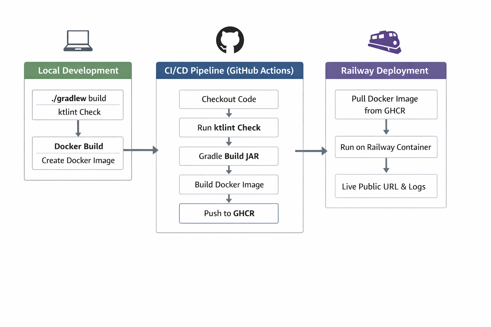

# Kotlin Self Observer

A simple Kotlin application with a full **CI/CD pipeline**, Dockerized, and deployed to Railway for experimentation and learning.

This project is designed to help you learn **Kotlin, Gradle, Docker, GitHub Actions, GHCR, and deployment workflows**.

---

## 🚀 Features

- Kotlin application built with Gradle
- Code style enforced using **ktlint** (runs automatically during build)
- Dockerized for easy deployment
- Full CI/CD pipeline:
    - Builds jar using Gradle
    - Runs ktlintCheck
    - Builds Docker image
    - Pushes image to **GitHub Container Registry (GHCR)**
    - Deploys to **Railway** automatically
- Public deployment URL for testing



---

## 🛠️ Requirements

- JDK 21
- Docker
- Gradle wrapper (`./gradlew` included)
- GitHub account (for CI/CD + GHCR)
- Railway account (free, no credit card required)

---

## 💻 Local Setup

1. Clone the repo:

```bash
git clone https://github.com/jason-kaleb/kotlin-self-observer.git
cd kotlin-self-observer
```